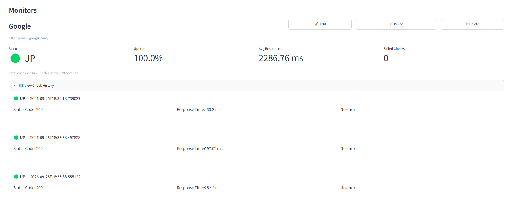
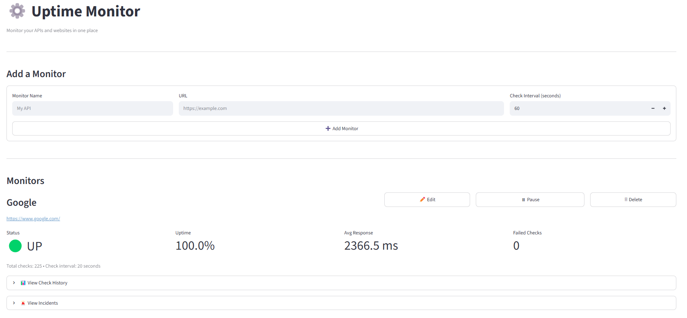
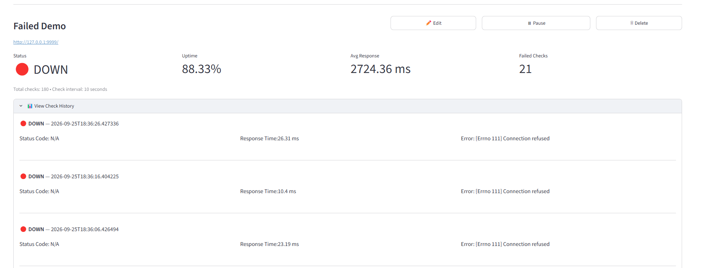
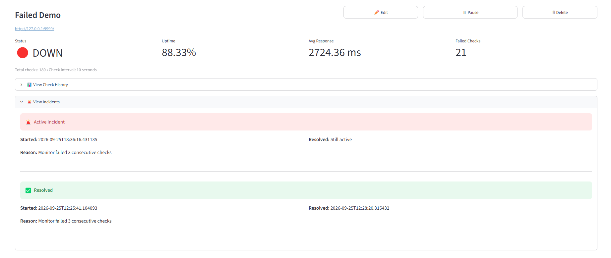
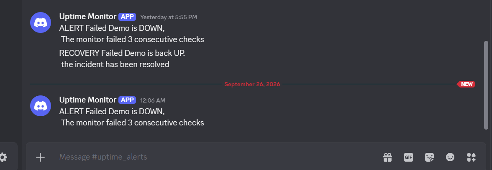

# ⚙️ Uptime Monitor

A lightweight uptime monitoring system that periodically checks APIs and websites, records response metrics, detects consecutive failures, tracks incidents, and sends Discord alerts when a service goes down or recovers.

The project includes a **FastAPI backend**, **APScheduler-based background monitoring**, **SQLite persistence**, and a **Streamlit dashboard**, with Docker support for running the backend and frontend as separate services.

## 📸 Screenshots

### Dashboard



### Add Monitor



### Consecutive Failure Detection



### Incident Tracking



### Discord Alerts



---

## 🚀 Features

* Add and manage API/website monitors
* Configurable monitoring intervals
* Automatic background health checks
* HTTP status and response-time tracking
* Uptime percentage calculation
* Failed-check tracking
* Pause and resume monitoring
* Monitor editing and deletion
* Detection of 3 consecutive failures
* Incident creation and resolution tracking
* Discord webhook alerts for downtime
* Recovery notifications when a service becomes available again
* Persistent SQLite database
* REST API using FastAPI
* Interactive Streamlit dashboard
* Dockerized backend and frontend

---

## 🏗️ Architecture

```text
                         ┌──────────────────────┐
                         │   Streamlit Dashboard│
                         │       :8501          │
                         └──────────┬───────────┘
                                    │ HTTP
                                    ▼
                         ┌──────────────────────┐
                         │    FastAPI Backend   │
                         │       :8000          │
                         └──────────┬───────────┘
                                    │
                    ┌───────────────┼────────────────┐
                    │               │                │
                    ▼               ▼                ▼
             ┌───────────┐   ┌─────────────┐   ┌──────────────┐
             │ Scheduler │   │   Monitor   │   │   Database   │
             │ APScheduler│  │ Health Check│   │   SQLite     │
             └─────┬─────┘   └──────┬──────┘   └──────────────┘
                   │                 │
                   │                 ▼
                   │          ┌─────────────┐
                   │          │   Incident  │
                   │          │   Detection │
                   │          └──────┬──────┘
                   │                 │
                   │                 ▼
                   │          ┌─────────────┐
                   └─────────►│   Discord   │
                              │   Webhook   │
                              └─────────────┘
```

---

## 🔄 Monitoring Flow

When a monitor is created, the backend registers it with the APScheduler.

```text
                          Create Monitor
                                ↓
                        Store Monitor in SQLite
                                ↓
                        Schedule Background Check
                                ↓
                        Send HTTP Request
                                ↓
                        Measure Response Time
                                ↓
                        Store Check Result
                                ↓
                        Check Failure History
                                ↓
                        3 Consecutive Failures?
                            ↙             ↘
                          Yes               No
                            ↓                ↓
                        Create Incident   Continue Monitoring
                            ↓
                     Send Discord Alert
```

When a failed monitor becomes healthy again:

```text
                  Successful Check
                        ↓
                 Open Incident Exists?
                        ↓
                       Yes
                        ↓
                 Resolve Incident
                        ↓
                 Send Recovery Alert
```

---

## 🚨 Incident Detection

The monitor does not create an incident after a single failed request.

Instead, the system checks the most recent results for a monitor.

An incident is created when:

```text
                     Failure
                        ↓
                     Failure
                        ↓
                     Failure
                        ↓
                🚨 Incident Created
```

This helps reduce unnecessary alerts caused by temporary network problems.

When a successful check occurs while an incident is open, the incident is marked as resolved and a recovery notification is sent.

---

## 🔔 Discord Alerts

The application supports Discord webhook notifications.

Alerts are sent for:

* 3 consecutive monitor failures
* Service recovery after an incident

Example flow:

```text
                  Monitor DOWN
                        ↓
                3 consecutive failures
                        ↓
                 Incident created
                        ↓
                 Discord webhook
                        ↓
             🚨 Downtime notification
```

The webhook URL is configured through an environment variable rather than being stored directly in the source code.

---

## 🖥️ Dashboard

The Streamlit dashboard provides a simple interface for managing monitors and viewing their health.

### Monitor Management

Users can:

* Add monitors
* Edit monitor configuration
* Pause monitoring
* Resume monitoring
* Delete monitors

### Metrics

The dashboard displays:

* Current status
* Uptime percentage
* Average response time
* Failed checks
* Total checks
* Monitoring interval

### History

Each monitor provides access to its recent check history, including:

* HTTP status code
* Response time
* Check timestamp
* Error message when applicable

### Incidents

The dashboard also displays:

* Incident status
* Start time
* Resolution time
* Failure reason

---

## 🧰 Tech Stack

| Technology       | Purpose                    |
| ---------------- | -------------------------- |
| Python           | Core application logic     |
| FastAPI          | REST API backend           |
| Streamlit        | Monitoring dashboard       |
| APScheduler      | Background monitoring jobs |
| SQLAlchemy       | Database ORM               |
| SQLite           | Persistent data storage    |
| HTTPX            | HTTP health checks         |
| Pydantic         | API validation             |
| Docker           | Containerization           |
| Docker Compose   | Multi-container setup      |
| Discord Webhooks | Alert notifications        |
| Pytest           | Automated testing          |

---

## 📁 Project Structure

```text
Uptime_Monitor/
│
├── app/
│   ├── __init__.py
│   ├── alert.py
│   ├── database.py
│   ├── init_db.py
│   ├── main.py
│   ├── models.py
│   ├── monitor.py
│   ├── scheduler.py
│   ├── schemas.py
│   ├── test_monitor.py
│   └── test_scheduler.py
│
├── screenshots/
│   ├── add_monitors.png
│   ├── success_monitor.png
│   ├── 3_consecutive_failures.png
│   ├── incident_tracking.png
│   └── discord_alerts.png
│
├── app.py
├── Dockerfile
├── Dockerfile.streamlit
├── docker-compose.yml
├── .dockerignore
├── .gitignore
├── requirements.txt
└── README.md
```

---

## 🔌 API Endpoints

### Monitor Management

| Method   | Endpoint         | Description            |
| -------- | ---------------- | ---------------------- |
| `POST`   | `/monitors`      | Create a monitor       |
| `GET`    | `/monitors`      | Get all monitors       |
| `GET`    | `/monitors/{id}` | Get a specific monitor |
| `PUT`    | `/monitors/{id}` | Update monitor         |
| `DELETE` | `/monitors/{id}` | Delete monitor         |

### Monitoring Data

| Method | Endpoint                   | Description                 |
| ------ | -------------------------- | --------------------------- |
| `GET`  | `/monitors/{id}/status`    | Get current monitor metrics |
| `GET`  | `/monitors/{id}/history`   | Get check history           |
| `GET`  | `/monitors/{id}/incidents` | Get monitor incidents       |

FastAPI also provides interactive API documentation through:

```text
http://localhost:8000/docs
```

---

## 🐳 Running with Docker

### Prerequisites

* Docker Desktop
* Docker Compose

Clone the repository:

```bash
git clone https://github.com/donna2864/Uptime-Monitor.git
cd Uptime_Monitor
```

Create a `.env` file:

```env
WEBHOOK_URL=your_discord_webhook_url
```

Start the application:

```bash
docker compose up --build
```

The services will be available at:

```text
Backend:
http://localhost:8000

API Documentation:
http://localhost:8000/docs

Dashboard:
http://localhost:8501
```

To stop the application:

```bash
docker compose down
```

---

## 💻 Running Locally

Create and activate a virtual environment:

### Windows

```powershell
python -m venv venv
venv\Scripts\activate
```

Install dependencies:

```powershell
pip install -r requirements.txt
```

Start the FastAPI backend:

```powershell
uvicorn app.main:app --reload
```

In another terminal, start Streamlit:

```powershell
streamlit run app.py
```

The dashboard will be available at:

```text
http://localhost:8501
```

---

## 🧪 Testing

The project includes tests for the monitoring and scheduler components.

Run:

```powershell
pytest
```

The test suite covers scenarios including:

* Successful health checks
* Failed health checks
* Inactive monitors
* Multiple successful checks
* Multiple failed checks
* Incident creation after consecutive failures
* Incident recovery
* Scheduler job creation
* Scheduler job removal

---

## 🔐 Configuration

Environment-specific configuration is kept outside the source code.

Example:

```env
WEBHOOK_URL=your_discord_webhook_url
```

The dashboard can also use:

```env
API_URL=http://127.0.0.1:8000
```

When running through Docker Compose, the frontend communicates with the backend using the Docker service name.

---

## 🎯 What I Built

This project was built to understand how a basic monitoring system works beyond simply making HTTP requests.

The main focus was on:

* Background job scheduling
* Persistent monitor configuration
* Health-check result storage
* Failure detection
* Incident lifecycle management
* Alert and recovery workflows
* REST API design
* Docker-based deployment
* Building a dashboard around backend services

---

## 📌 Future Improvements

Potential extensions include:

* Redis-based distributed scheduling
* Multiple notification channels such as email and Slack
* Authentication and role-based access
* Response-body/content validation
* SSL certificate monitoring
* Configurable failure thresholds
* Historical uptime charts
* Prometheus/Grafana integration
* Distributed monitoring from multiple regions

---

## 👩‍💻 Author

**Donna R**
